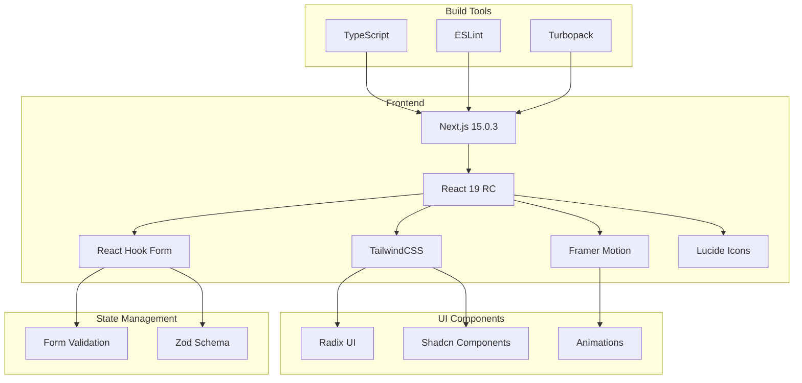
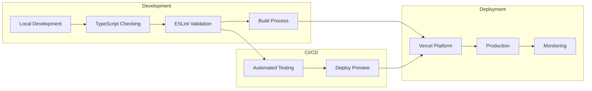
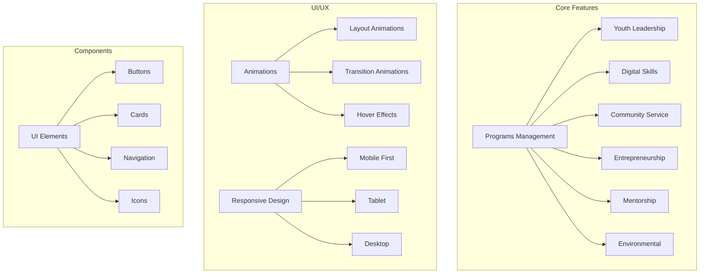

# SmartLife NGO Platform

A modern web platform built with Next.js for managing youth development programs and community initiatives.

## Tech Stack & Architecture

This is a [Next.js](https://nextjs.org) project bootstrapped with [`create-next-app`](https://nextjs.org/docs/app/api-reference/cli/create-next-app).



## Getting Started

First, run the development server:

```bash
npm run dev
# or
yarn dev
# or
pnpm dev
# or
bun dev
```

Open [http://localhost:3000](http://localhost:3000) with your browser to see the result.

You can start editing the page by modifying `app/page.tsx`. The page auto-updates as you edit the file.

This project uses [`next/font`](https://nextjs.org/docs/app/building-your-application/optimizing/fonts) to automatically optimize and load [Geist](https://vercel.com/font), a new font family for Vercel.



## Feature Architecture




Open [http://localhost:3000](http://localhost:3000) with your browser to see the result.

## Key Features

- **Modern Tech Stack**: Built with Next.js 15, React 19, and TypeScript
- **Responsive Design**: Mobile-first approach with TailwindCSS
- **Smooth Animations**: Powered by Framer Motion
- **Accessible Components**: Built on Radix UI primitives
- **Type Safety**: Full TypeScript support
- **Performance Optimized**: Using Next.js app router and Turbopack
- **Development Tools**: ESLint configuration for code quality

## Project Structure
smartlife_ngo/
├── app/
│ ├── programs/
│ │ ├── page.tsx
│ │ └── [program]/
│ │ └── page.tsx
│ └── page.tsx
├── components/
│ └── ui/
├── public/
└── styles/


## Learn More

To learn more about the technologies used:

- [Next.js Documentation](https://nextjs.org/docs)
- [React Documentation](https://react.dev)
- [TailwindCSS Documentation](https://tailwindcss.com/docs)
- [Framer Motion Documentation](https://www.framer.com/motion/)
- [TypeScript Documentation](https://www.typescriptlang.org/docs/)

## Deployment

The application is optimized for deployment on the [Vercel Platform](https://vercel.com).

## Contributing

Contributions are welcome! Please read our contributing guidelines for details.
